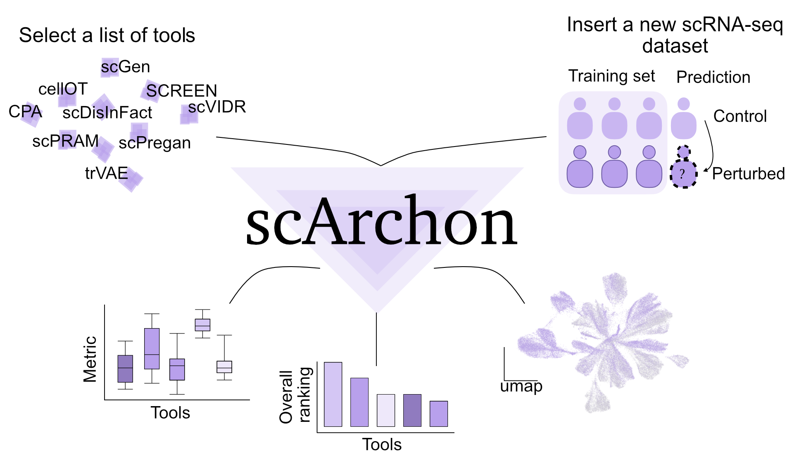

<p align="center">
  
</p>

# scArchon: benchmark or run single-cell prediciton tools on your own dataset

scArchon is a modular, reproducible benchmarking platform for evaluating single-cell perturbation response prediction tools. Built on Snakemake, it provides an extensible framework to compare deep learning methods across diverse datasets using both statistical and biological metrics. Why scArchon?
While many tools exist to predict single-cell responses to perturbations (e.g., drug treatments), their systematic comparison has been limited. scArchon helps standardize benchmarking and highlights important nuances—such as when models with high quantitative scores fail to retain key biological signals.

We invite the community to adopt and contribute to scArchon, helping accelerate progress in single-cell perturbation modeling.

# Requirements
Running the deep learning models require GPU with CUDA 12.4+. To pull the environments from Dockerhub, Singularity 3.6+ needs to be installed on your machine. To store the environments, a disk space of about 50 GB is required. 

- CUDA 12.4+ (tested on 12.4)
- Singularity 3.6+ (tested on 3.6 and 4.1)
- About 50 GB disk space to download all environments  

# Installation
- Create a conda environment with snakemake:
    ```python
    conda create -c conda-forge -c bioconda -n snakemake_env snakemake
    ```
- Activate the environment: `conda activate snakemake_env`
- Ensure that you have a GPU with CUDA 12.4+ and Singularity 3.6+ available

# Input / Outputs
- Input: annotated dataset (adata) in .h5ad format. The dataset should ideally be count normalised (typically to 10,000) and log-normalised. The dataset should contain the couples control-perturbed necessary for the training along the control you want to get the prediciton from. See the Kang dataset and the section below for an example.
- Outputs:
    - .h5ad with prediction, alongside the control and perturbed data. Stored in `results/{experiment_name}/h5ad/{experiment_name}_{tool}_{target}.h5ad`
    - Metrics results. Stored in `results/{experiment_name}/metrics/{experiment_name}_{tool}_{target}_distance_scores.csv`
    - Dimension reduction visualisation. Stored in `results/{experiment_name}/biology/{experiment_name}_{tool}_{target}_dim_red_vis.pdf`
    - Gene set enrichment analysis. Stored in `results/{experiment_name}/biology`
        - the file `{experiment_name}_{tool}_{target}_predicted_singificantly_enriched_terms.csv` contains the the enriched terms from the top 1,000 DEGs between control and predicted
        - the file `{experiment_name}_{tool}_{target}_stimulated_singificantly_enriched_terms.csv` contains the the enriched terms from the top 1,000 DEGs between control and stimulated
        - the file `{experiment_name}_{tool}_{target}_common_singificantly_enriched_terms.csv` contains the the enriched terms from the top 1,000 DEGs between stimulated and predicted (and not the intersection of the two previous files!)
        - the image `{experiment_name}_{tool}_{target}_shared_enriched_terms.pdf` shows the terms from predicted and stimulated files that are common to both
        - the image `{experiment_name}_{tool}_{target}_score_genes_enriched_terms_only_in_predicted.pdf`shows the gene score for top 6 most statistically significant GO terms from the predicted file (compated to control)
        - the image `{experiment_name}_{tool}_{target}_score_genes_enriched_terms_only_in_stimulated.pdf`shows the gene score for top 6 most statistically significant GO terms from the perturbed file (compated to control)
        -  the image `{experiment_name}_{tool}_{target}_score_genes_enriched_terms_common.pdf` shows the gene score for top 6 most statistically significant GO terms that are shared between the predicted and perturbed files. 


# Running your experiments

- Clone or download scArchon and cd into the directory.
- You can set up your experiments in `config/datasets.tsv`.

<div align="center">
    
</div>

- If you are running the tools on a single GPU, it is suggested to run the tools one by one, otherwise the tasks will swap and will take overall longer. We suggest to run the pipeline with following command:

    ```python
    snakemake --use-singularity --singularity-args '--nv -B .:/dum' --cores all --jobs 1 --keep-going
    ```

    - `--use-singularity` will pull the docker images from the web
    - `--singularity-args '--nv -B .:/dum'` ensures GPU usage
    -  `--cores all` requests all CPUs available
    - `--jobs 1` runs one job after the other
    - `--keep-going` ensures the pipeline continues running even if there is a bug in one of the tool to not lose time

# User-useful information
- Pulling environment via singularity may take some time depending on your downloading speed. The environment only needs to be pulled once. It will be stored under `.snakemake/singularity`.
- The running time of some tools can be long. Given the performance of cellOT, CPA and scPreGAN, we suggest you to leave them out of your run.

<div align="center">
    
</div>

| | Singularity image disk space|
|-----|:-----------------------:|
|cellot (+scgen)| 2.22 GB (+6.08 GB)|
|cpa| 6.48 GB|
|scgen| 6.08 GB|
|scvidr| 5.97 GB|
|scpram| 4.67 GB|
|scpregan| 7.19 GB|
|scdisinfact| 6.71 GB|
|trvae| 6.48 GB|
|screen||
|metrics/linear/control| 8.04 GB|

In details, the different tools require following CUDA versions:

||CUDA version|
|--|:----------:|
|cellot| 10.2 |
|cpa| 11.7|
|scdisinfact|12.4|
|scpram|11.6|
|scvidr|12.1|
|scpregan| 12.1 |
|screen| 11.7|
|scgen| 11.7|
|trvae| 12.4|

Below CUDA 11.6, no tool can be ran. After CUDA 12.4 all tools can be ran. Note that cellOT does not requ


