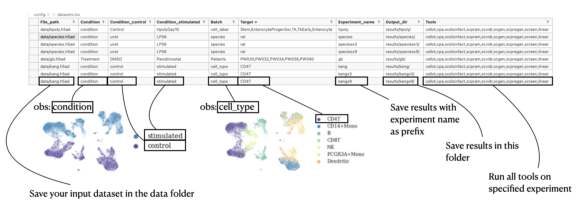

# Requirements
- CUDA 12.4+ (tested on 12.4)
- Singularity 3.6+ (tested on 3.6 and 4.1)

In details, the different tools require following CUDA versions:

||CUDA version|
|--|----------|
|cellot| 10.2 |
|cpa| 11.7|
|scdisinfact|12.4|
|scpram|11.6|
|scvidr|12.1|
|scpregan| <= 12.4 |
|screen| 11.7|
|scgen| 11.7|

Below CUDA 11.6, no tool can be ran. After CUDA 12.4 all tools can be ran. 

# Installation
- Create a conda environment with snakemake:
    ```python
    conda create -c conda-forge -c bioconda -n snakemake_env snakemake
    conda activate snakemake_env
    ```
- Activate the environment: `conda activate snakemake_env`
- Ensure that you have a GPU (see above for versions) and singularity running (if on a cluster, maybe can be loaded using `module avail`, then `module load singularity-X.X.X`)

# Setting up your experiments
- You can set up your experiments in `config/datasets.tsv`.

<div style="text-align: center; margin-top: 20px; margin-bottom: 20px;">
    
</div>

- If you are running the tools on a single GPU, it is suggested to run the tools one by one, otherwise the tasks will swap and will take overall longer. We suggest to run the pipeline with following command:

    ```python
    snakemake --use-singularity --singularity-args '--nv -B .:/dum' --cores all --jobs 1 --keep-going
    ```

    - `--use-singularity` will pull the docker images from the web
    - `--singularity-args '--nv -B .:/dum'` ensures GPU usage
    -  `--cores all` requests all CPU available
    - `--jobs 1` runs one job after the other
    - `--keep-going` ensures the pipeline continues running even if there is a bug in one of the tool

# Preprocessing
- Normalise your dataset as follows:
    - total counts normalised to 10'000
    - log1p
    - ensure unique var and obs names. Ideally you have both HUGO and ENSEMBL namings.

